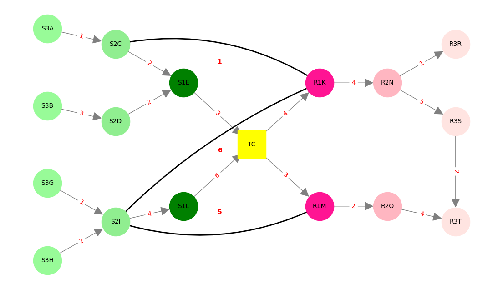
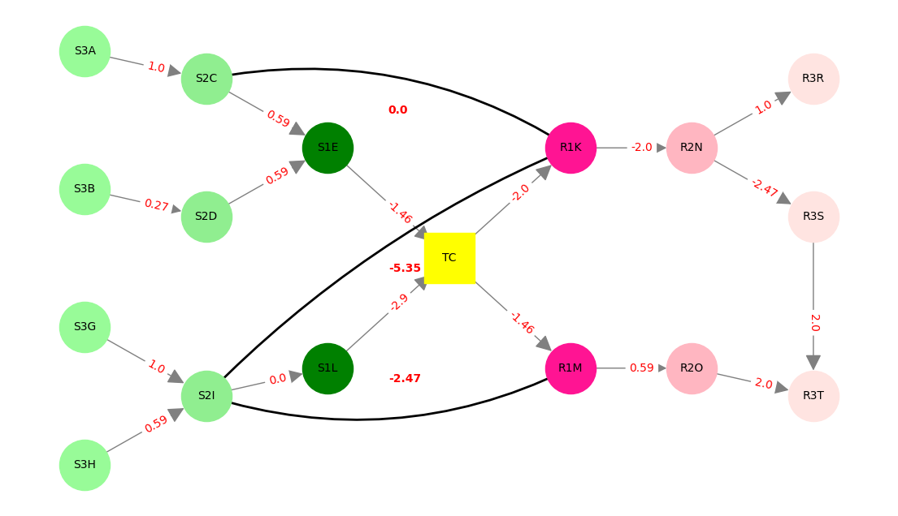
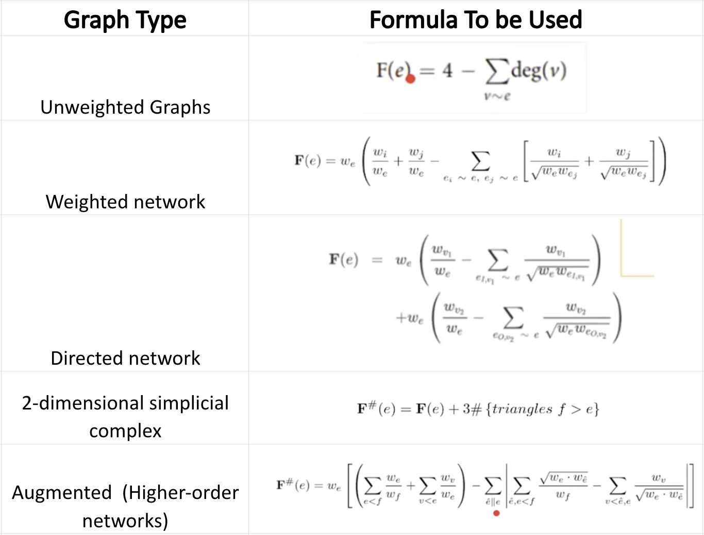

# Forman-Ricci Curvature Analysis on given Graph

## Task Assigned

Using the **NetworkX** library in Python, the goal is to construct the given graph with weighted edges and directions as shown in the graph image. 

My task breakdown is as follows:

1. Constructing the provided graph by ensuring that edges follow the correct flow along with their weights.
2. Computing the **Forman-Ricci curvature** for each edge present in the graph.
3. Annotating the calculated curvature values on the graph for demonstration.

## Input Graph:

## Output Graph:

## Learnings from the task

- **Forman-Ricci Curvature**: Explored how curvature can be calculated for edges in various graph types and the significance of its value.
- **Graph Annotation**: Understood the process of adding the weight or the computed values onto graph visualizations and making it presentable.
- **Handling Directed vs. Undirected Edges**: Understood and differentiated between directed and undirected edges, ensuring proper connectivity and curvature computation with the correct use of the formule mentioned from the video.
- **Understanding Curvature**: Explored various formulae that captures curvature and its usage in real world scenarios.
    - **Formulae used**:
    
        
## Execution Instructions for Running the Code

1. Download the .ipynb file.
1. Install the necessary library "NetworkX".
2. Load the .ipynb notebook using Google Colab or Jupyter Notebook (if installed) or VS Code with Python and Jupyter extensions.
3. Run the notebook to execute and generate the annotated graph with the curvature calculated.

---
**Author**: Aashna Arun  
**Date**: February 2025  
